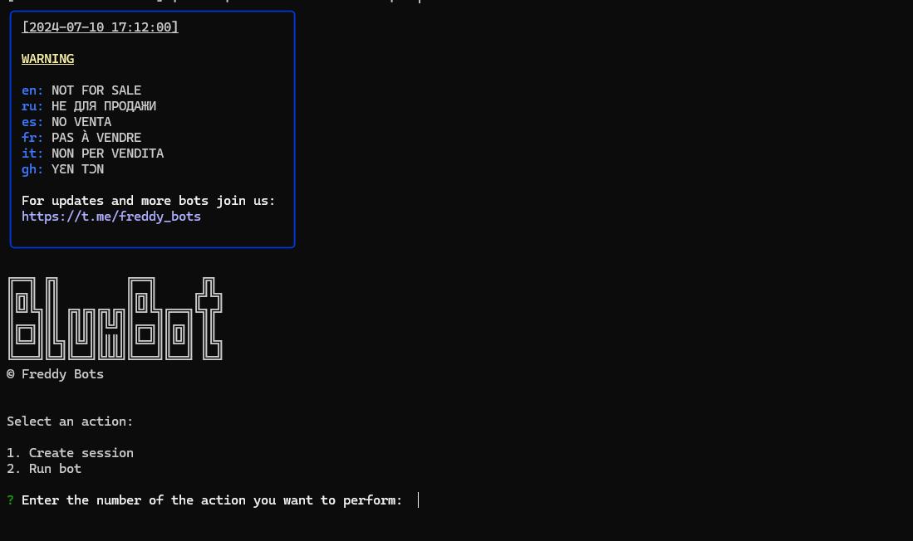

> [](https://t.me/roddyfred)



# Use Node.Js 18 or later

## Functionality

| Functional                       | Supported |
| -------------------------------- | :-------: |
| Claiming daily reward            |    ✅     |
| Claiming Farming reward          |    ✅     |
| Claiming Friends reward          |    ✅     |
| Starting Farming                 |    ✅     |
| Playing games                    |    ✅     |
| Multithreading                   |    ✅     |
| Binding a proxy to a session     |    ✅     |
| Random sleep time between clicks |    ✅     |

## [Settings](https://github.com/FreddyWhest/BlumBot/blob/main/.env-example)

| Settings                      | Description                                                               |
| ----------------------------- | ------------------------------------------------------------------------- |
| **API_ID / API_HASH**         | Platform data from which to launch a Telegram session (stock - Android)   |
| **CLAIM_DAILY_REWARD**        | Whether the bot should Claim daily rewards (True / False)                 |
| **CLAIM_FRIENDS_REWARD**      | Whether the bot should Claim friends rewards (True / False)               |
| **AUTO_PLAY_GAMES**           | Whether the bot should play blum game and claim reward (True / False)     |
| **AUTO_START_FARMING**        | Whether the bot should start farming (True / False)                       |
| **AUTO_CLAIM_FARMING_REWARD** | Whether the bot should claim farming rewards(True / False)                |
| **AUTO_JOIN_TRIBE**           | Whether the bot should join tribe [Freddy_bots] (True / False)            |
| **SLEEP_BETWEEN_TAP**         | Delay between taps in seconds (eg. 70)                                    |
| **USE_PROXY_FROM_FILE**       | Whether to use proxy from the `bot/config/proxies.js` file (True / False) |

## Installation

You can download [**Repository**](https://github.com/FreddyWhest/BlumBot) by cloning it to your system and installing the necessary dependencies:

```shell
~ >>> git clone https://github.com/FreddyWhest/BlumBot.git
~ >>> cd BlumBot

#Linux and MocOS
~/BlumBot >>> chmod +x check_node.sh
~/BlumBot >>> ./check_node.sh

OR

~/BlumBot >>> npm install
~/BlumBot >>> cp .env-example .env
~/BlumBot >>> nano .env # Here you must specify your API_ID and API_HASH , the rest is taken by default
~/BlumBot >>> node index.js

#Windows
1. Double click on INSTALL.bat in BlumBot directory to install the dependencies
2. Double click on START.bat in BlumBot directory to start the bot

OR

~/BlumBot >>> npm install
~/BlumBot >>> cp .env-example .env
~/BlumBot >>> # Specify your API_ID and API_HASH, the rest is taken by default
~/BlumBot >>> node index.js
```

Also for quick launch you can use arguments, for example:

```shell
~/BlumBot >>> node index.js --action=1

OR

~/BlumBot >>> node index.js --action=2

#1 - Create session
#2 - Run clicker
```
